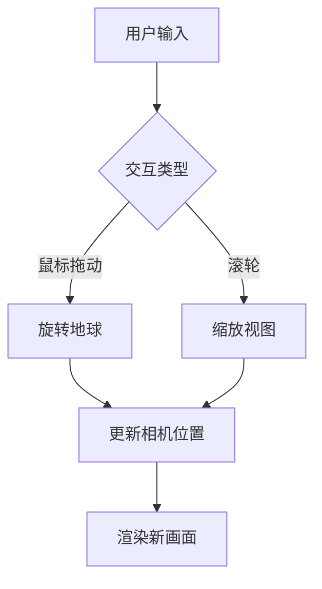

# 地球仪

一个基于Three.js的交互式3D地球仪，具有自转、光照效果和表面波动动画，支持有限范围的缩放以观察大陆板块。

## 技术实现

### 核心功能

1. **3D地球模型**
   - 使用Three.js的SphereGeometry创建球体
   - 应用高清地球表面纹理贴图
   - 添加法线贴图增强表面细节
   - 使用高光贴图增强光照效果

2. **大气和云层**
   - 半透明大气层创造光晕效果
   - 动态云层系统增强真实感
   - 使用透明度和混合模式实现层次感

3. **光照系统**
   - 定向光源模拟太阳光
   - 环境光提供基础照明
   - 材质的反射和高光效果

4. **动画效果**
   - 地球自转动画
   - 云层独立运动
   - 正弦波动画模拟表面波动

### 交互设计



## 使用方法

1. 在浏览器中打开index.html
2. 使用鼠标拖动来旋转地球
3. 使用鼠标滚轮进行缩放
   - 最小缩放距离：3个单位（可看到完整地球）
   - 最大缩放距离：10个单位（可观察大陆板块）

## 技术栈

- Three.js - 3D图形渲染
- OrbitControls - 相机控制
- 原生JavaScript - 动画和交互逻辑

## 项目结构

```
Earth/
├── .config         # 项目配置文件
├── index.html      # 入口文件
├── README.md       # 项目文档
└── js/
    └── earth.js    # 核心实现代码
```