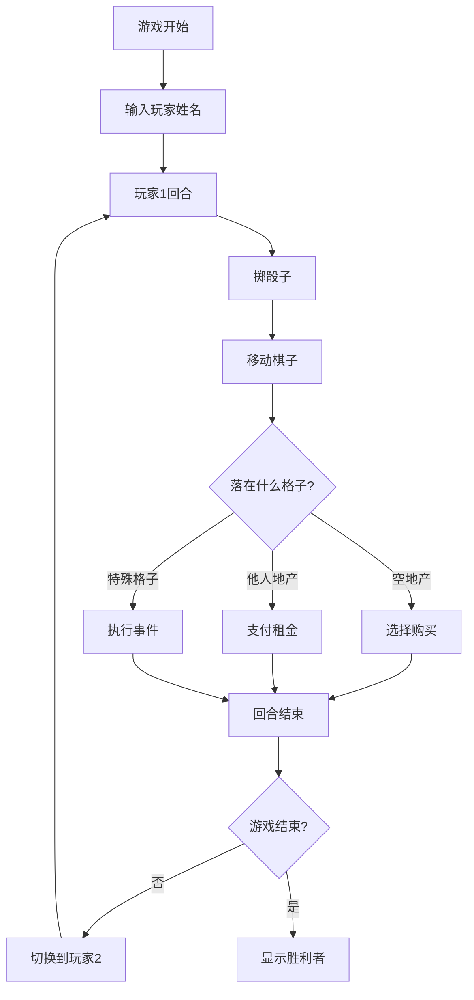

# 大富翁游戏

一个经典的大富翁游戏，支持两名玩家在同一台电脑上轮流游戏。游戏完全在浏览器中运行，无需额外的服务器支持。

## 游戏规则

### 基本规则
1. **开始游戏**
   - 游戏开始时输入两位玩家的名字
   - 每位玩家初始资金为1500元

2. **回合流程**
   - 玩家轮流掷两颗骰子
   - 根据点数在棋盘上顺时针移动
   - 根据落点执行相应操作

3. **地产系统**
   - 空地可以购买成为地产
   - 已有主人的地产需支付租金
   - 收集相同颜色的地产可以建造房屋
   - 房屋越多，租金越高

4. **特殊格子**
   - 起点：经过或停留可获得200元
   - 监狱：需要掷出双数或支付50元才能出狱
   - 机会和命运：抽取卡片执行随机事件
   - 税收：需要支付一定金额的税款

5. **胜利条件**
   - 当一名玩家破产（资金为负且无法偿还）时，另一名玩家获胜

### 详细游戏流程



## 技术实现

### 架构设计
```
Game/Monopoly/
├── .config                 # 游戏配置文件
├── index.html             # 游戏入口文件
├── README.md              # 游戏说明文档
├── css/                   # 样式文件
│   └── monopoly.css       # 游戏样式
└── js/                    # JavaScript文件
    ├── game.js           # 游戏主逻辑
    ├── board.js          # 棋盘管理
    ├── player.js         # 玩家类
    ├── property.js       # 地产管理
    ├── cards.js          # 机会/命运卡片
    ├── dice.js           # 骰子逻辑
    └── ui.js             # 用户界面管理
```

### 关键特性
1. **纯前端实现**
   - 使用HTML5 Canvas绘制游戏界面
   - 纯JavaScript实现游戏逻辑
   - 无需后端服务器支持

2. **本地存储**
   - 使用localStorage保存游戏进度
   - 支持保存最高分记录

3. **响应式设计**
   - 适配不同屏幕尺寸
   - 支持触屏操作

## 运行方式

1. **本地运行**
   - 直接用浏览器打开index.html文件即可运行
   - 支持file://协议，无需Web服务器

2. **Web服务器运行**
   - 将游戏文件放置在任意Web服务器上
   - 通过HTTP/HTTPS访问index.html

## 操作说明

- **掷骰子**：点击"掷骰子"按钮或按空格键
- **购买地产**：点击"购买"按钮或按回车键
- **建造房屋**：在自己的回合，选择地产后点击"建房"按钮
- **查看信息**：鼠标悬停在地产上可查看详细信息
- **回合切换**：自动在两名玩家之间切换回合

## 开发说明

游戏采用模块化设计，各个组件职责明确：
- board.js：管理棋盘状态和渲染
- player.js：处理玩家数据和行为
- property.js：管理地产系统
- cards.js：处理机会和命运卡片
- dice.js：实现骰子功能
- ui.js：处理用户界面交互
- game.js：协调各个模块，实现游戏主循环

## 注意事项

1. 游戏支持现代浏览器（Chrome、Firefox、Safari、Edge等）
2. 建议使用1024x768或更高分辨率显示器
3. 游戏数据保存在浏览器本地存储中，清除浏览器数据会导致游戏进度丢失
