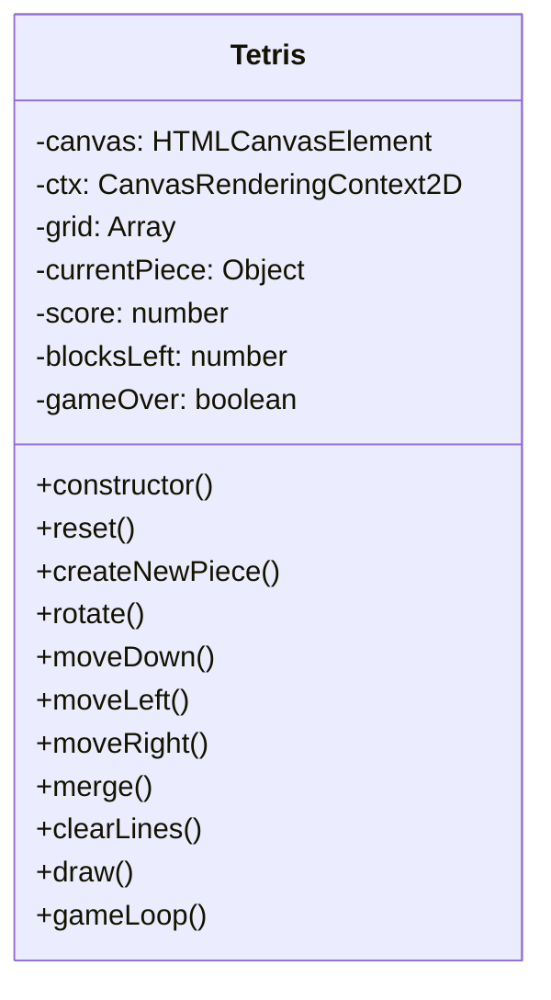

# 俄罗斯方块游戏

## 游戏简介
这是一个经典的俄罗斯方块游戏实现。玩家需要控制不同形状的方块，通过旋转和移动使其合理堆叠。游戏共有100个方块，在空间被挤满前坚持到底即可获胜。

## 技术架构

### 核心技术栈
- HTML5 Canvas：游戏渲染
- 原生JavaScript：游戏逻辑实现
- CSS：界面样式

### 项目结构
```
Tetris/
├── .config/
│   └── config.json    # 游戏配置文件
├── index.html         # 游戏入口文件
├── js/
│   └── tetris.js      # 游戏核心逻辑
└── README.md         # 说明文档
```

### 核心类设计



## 游戏功能

### 基本玩法
- 使用方向键控制方块移动和旋转
- ↑：旋转方块
- ←：向左移动
- →：向右移动
- ↓：加速下落

### 游戏规则
1. 游戏开始时有100个方块
2. 每消除一行可得100分
3. 当方块堆到顶部时游戏结束
4. 使用完100个方块前保持空间未被挤满即获胜

### 胜负判定
- 胜利条件：使用完100个方块，且游戏未结束
- 失败条件：方块堆积到顶部，游戏提前结束

## 技术实现细节

### 方块系统
- 7种基本方块形状
- 每种方块都有独特的颜色
- 使用二维数组表示方块形状
- 支持90度旋转变形

### 碰撞检测
- 边界检测：防止方块移出游戏区域
- 方块间碰撞检测：防止方块重叠
- 底部检测：确定方块固定位置

### 消行机制
- 自动检测填满的行
- 消行后上方方块下落
- 更新分数和剩余方块数

## 运行说明
1. 直接在浏览器中打开index.html即可运行游戏
2. 也可以部署在任意Web服务器上运行
3. 游戏支持所有现代浏览器